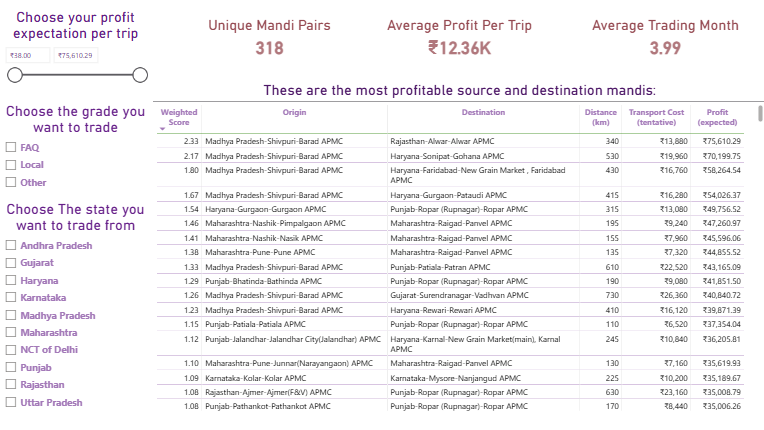

# Tomato Price Arbitrage — AgMarkNet India

A SQL-based analytical model to identify profitable inter-mandi tomato trade routes for a small entrepreneur operating a single 3MT truck across 11 Indian states.

---

## The Problem

Price crashes at farm gates and price spikes in urban markets often happen simultaneously. The information to bridge that gap exists — it's published daily by the Government of India on AgMarkNet. This project operationalises that data into actionable route recommendations.

---

## Dashboard

**318 viable mandi pairs | Avg. profit per trip: ₹12,360 | Avg. trading window: 3.99 months**

---

## Dataset

- **Source:** Agriculture Marketing Information System — [agmarknet.gov.in](https://agmarknet.gov.in), published by the Directorate of Marketing and Inspection, Department of Agriculture and Farmers Welfare, Government of India
- **Commodity:** Tomato
- **Period:** November 2025 – April 2026
- **States covered:** Andhra Pradesh, Gujarat, Haryana, Karnataka, Madhya Pradesh, Maharashtra, NCT of Delhi, Punjab, Rajasthan, Uttar Pradesh, Telangana
- **Raw records:** 39,074 rows (post-cleaning)

---

## Methodology

The pipeline runs across three SQL layers:

### Layer 1 — Staging (`price_analysis_staging`)
Cleans and standardises raw AgMarkNet data:
- **Grade standardisation:** Reclassified into three analytical categories — `FAQ` (GoI standard), `Local` (high volume, consistent behaviour), `Other` (Grade A, B, Non-FAQ, Medium). Grade `NA` excluded — under 1% of total volume, prices reflect individual trader behaviour rather than market consensus.
- **Type conversions:** Modal price and arrival quantity converted from comma-formatted TEXT to NUMERIC; arrival date reformatted from DD-MM-YYYY to YYYY-MM-DD.
- **Exclusions:** NULL arrival dates and Grade NA rows.

### Layer 2 — Arbitrage Identification (`tomato_price_arbitrage`)
Cross-joins source and destination mandis to identify directional price gaps:
- Source mandi price on date X vs destination mandi on date X+N (1–7 day window)
- Same-grade matching only (FAQ vs FAQ, Local vs Local, Other vs Other)
- Filters applied: minimum 6 tonne arrival quantity; minimum ₹100/quintal price gap; same-mandi exclusion via composite key (state-district-market)
- Output: 1,685,459 mandi pair comparisons across 37,062 distinct pairs

### Layer 3 — Logistics & Viability (`logistics_calculation`, `viable_tomato_arbitrage`)
Estimates one-way transport cost and net profit per trip:

**Vehicle assumptions:**
| Parameter | Value |
|---|---|
| Truck capacity | 3 MT (30 quintals) |
| Fuel efficiency | 4 km/litre |
| Fuel price | ₹92/litre |
| Spoilage (plastic crates) | 5% (conservative) |

**Fixed costs per trip:**
| Item | Cost |
|---|---|
| Loading & unloading | ₹1,600 (₹800 per mandi) |
| Crate rental (120 crates) | ₹600 |
| Weighing charges | ₹600 (₹300 per mandi) |
| Driver food allowance | ₹200 |

**Variable costs per km:**
| Item | Cost |
|---|---|
| Toll charges | ₹5/km |
| Maintenance | ₹3/km |
| Driver & assistant | ₹1/km |

**Distance logic:** Where Gemini returned conflicting distance values, the maximum was used — accounting for local/non-highway routes as the conservative (higher cost) case.

**Exclusion:** Mandi commission (2% of sale value) was excluded as destination arrival prices are unavailable in the dataset.

---

## Key Finding

7 of the top 12 most profitable source mandis are **Barad APMC, Shivpuri, Madhya Pradesh** — a result the model surfaced without being directed to look for it. Shivpuri is India's #1 tomato-producing district, Government-designated under the One District One Product (ODOP) scheme. Top routes flow northward into Haryana's urban consumption centres, with additional routes to Rajasthan, Gujarat, and Punjab.

---

## Limitations

- Transport cost assumptions are standardised, not real-time
- Mandi commission excluded from profit calculation
- This is a directional model — actual profit depends on execution, negotiation, and ground conditions
- Distance data sourced via Gemini; max value used where conflicts arose

---

## Tools

- **SQL** — Data cleaning, transformation, arbitrage modelling
- **Power BI** — Interactive dashboard with filters by profit threshold, grade, and state

---

## Author

Open to opportunities in data analysis, agritech, and supply chain analytics.
---
[LinkedIn](https://www.linkedin.com/in/asif-khan-data/)
